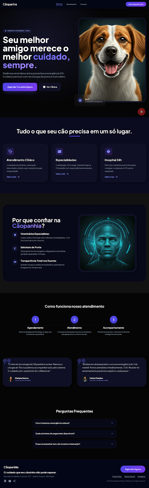

# 🐾 Cãopanhia — Landing Page de Clínica Veterinária Premium

> "Seu melhor amigo merece o melhor cuidado, sempre."


## Índice

- [Sobre o projeto](#sobre-o-projeto)
- [Funcionalidades](#funcionalidades)
- [Tecnologias utilizadas](#tecnologias-utilizadas)
- [Como usar](#como-usar)
- [Ajuda e suporte](#ajuda-e-suporte)
- [Autor](#autor)

## Sobre o projeto

**Cãopanhia** é uma landing page (página única) desenvolvida para uma clínica veterinária premium especializada em cães. O objetivo da página é converter visitantes em agendamentos de consulta, comunicando de forma visual três pilares: confiança, tecnologia de ponta e cuidado afetivo.



A interface segue um sistema de design próprio, documentado no arquivo [`DESIGN.md`](./DESIGN.md), batizado de **"Extruded Light"**: uma aplicação de **Neomorfismo / Soft UI**, em que os elementos parecem esculpidos ou extrudados diretamente da superfície de fundo, usando luz e sombra para criar profundidade — sem bordas, gradientes ou variações fortes de cor entre os elementos. Nesta implementação, o conceito foi adaptado para uma paleta **dark** (fundos em tons de preto/azul profundo), mantendo a mesma lógica de sombras suaves (raised/inset) descrita no sistema de design.

Este projeto serve tanto como página final para o negócio fictício "Cãopanhia" quanto como **referência/template** para quem quiser implementar Neomorfismo em modo escuro com Tailwind CSS, sem depender de frameworks de JavaScript.

## Funcionalidades

- **Header fixo (sticky)** com navegação e CTA de agendamento sempre visível.
- **Seção Hero** com chamada principal, dupla CTA ("Agendar Consulta Agora" / "Ver Clínica") e selo de atendimento 24h.
- **Grade de serviços** (Atendimento Clínico, Especialidades, Hospital 24h) em cards neomórficos com hover interativo.
- **Seção de confiança** ("Por que confiar na Cãopanhia?") destacando diferenciais da clínica.
- **Linha do tempo do atendimento** em 3 etapas (Agendamento → Atendimento → Acompanhamento).
- **Depoimentos de clientes** (prova social) com foto, nome e pet do tutor.
- **FAQ em acordeão**, construído apenas com HTML semântico (`<details>`/`<summary>`), sem necessidade de JavaScript.
- **Botão flutuante de emergência (FAB)** fixo na tela, sempre acessível.
- **Rodapé de conversão** com CTA final, endereço e links institucionais.
- **Totalmente responsivo**, com breakpoints mobile-first via utilitários do Tailwind.
- **Sistema visual consistente**: sombras neomórficas (raised/inset), texto e botões em gradiente indigo→violeta, e painel "glass" (vidro) sobre a imagem do hero.

## Tecnologias utilizadas

- **HTML5** — estrutura semântica da página.
- **[Tailwind CSS](https://tailwindcss.com/)** (via CDN, com os plugins `forms` e `container-queries`) — estilização utilitária, com um `tailwind.config` customizado contendo os tokens de cor do design system (primary, secondary, tertiary, surfaces, on-colors etc.).
- **[Google Fonts](https://fonts.google.com/)** — fonte **Plus Jakarta Sans** (tipografia do projeto) e **Material Symbols Outlined** (ícones).
- **CSS customizado** — classes próprias para o efeito neomórfico (`neomorph-raised`, `neomorph-inset`), texto em gradiente (`gradient-text`), botão em gradiente (`gradient-btn`) e painel em vidro (`glass-panel`).
- **Sem frameworks de JavaScript** — projeto 100% estático; a única interatividade (FAQ) é feita com elementos nativos do HTML.

## Como usar

Por ser um projeto estático (HTML + CSS via CDN), não há necessidade de instalação de dependências ou processo de build.

1. Clone o repositório:
   ```bash
   git clone https://github.com/SEU-USUARIO/caopanhia-landing.git
   cd caopanhia-landing
   ```

2. Abra o arquivo `index.html` diretamente no navegador (duplo clique) **ou** sirva a pasta com um servidor local:
   ```bash
   # com Node.js
   npx serve .

   # ou com Python
   python3 -m http.server 8000
   ```

3. Acesse a página (caso tenha usado um servidor local, em `http://localhost:8000`).

4. Para personalizar cores, tipografia ou componentes, edite o `tailwind.config` no próprio `index.html` e consulte o [`DESIGN.md`](./DESIGN.md) para manter a consistência do sistema neomórfico (raio de borda mínimo, sombras corretas, ausência de bordas/gradientes em elementos neomórficos etc.).

## Ajuda e suporte

- Encontrou um bug ou tem uma sugestão? Abra uma [**issue**](../../issues) no repositório.
- Antes de propor mudanças visuais, consulte o [`DESIGN.md`](./DESIGN.md) — ele documenta todas as regras do sistema de design (cores, sombras, tipografia e componentes).
- Para outras dúvidas, entre em contato diretamente com o autor do projeto (veja abaixo).

## Autor

Desenvolvido por **Daniel Ribeiro**.

[](https://github.com/SEU-USUARIO)
[](https://www.linkedin.com/in/SEU-USUARIO)

---

Distribuído sob a licença MIT.
